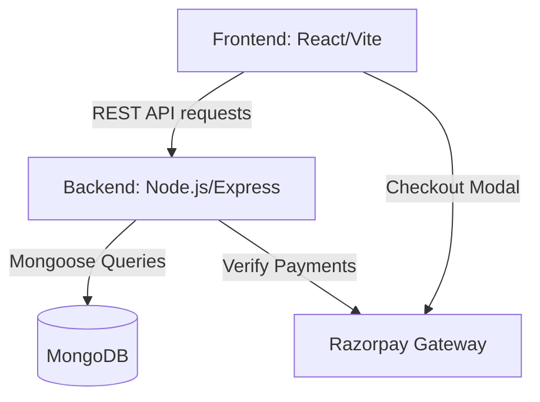
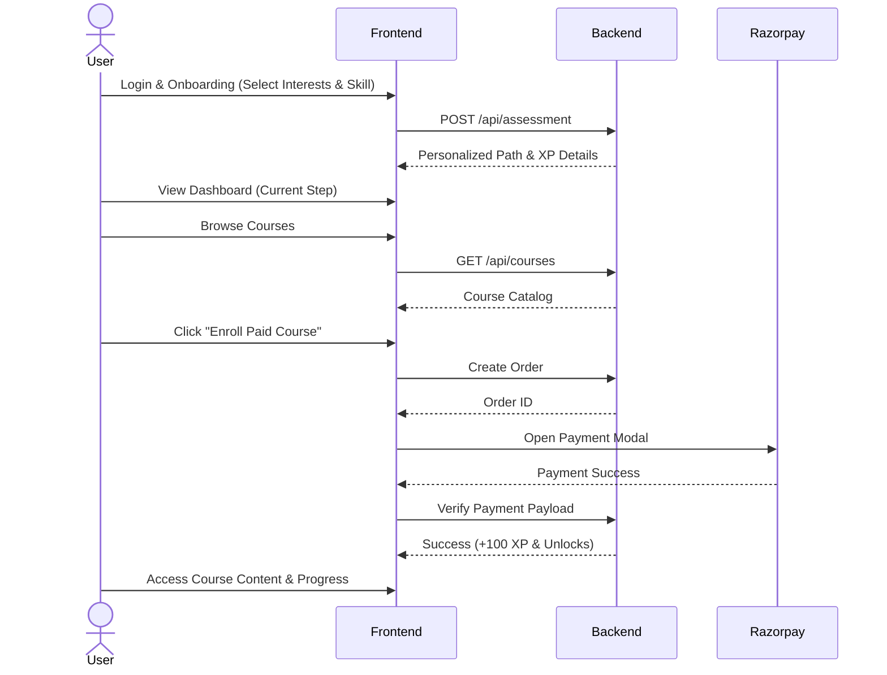
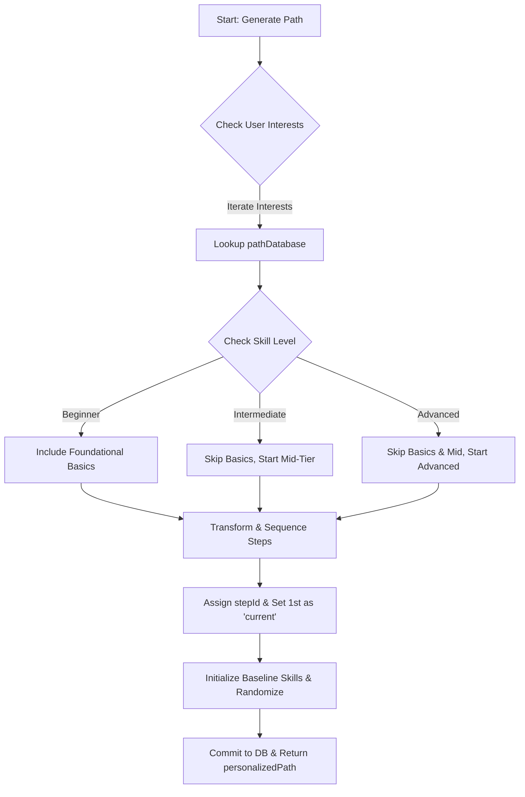

# NeuralPath - AI-Powered Learning Platform

## System Design & Architecture Document

---

## 1. System Design & Complete Workflow

NeuralPath is a modern e-learning platform built using the MERN stack (MongoDB, Express.js, React, Node.js) styled with Tailwind CSS and Framer Motion for a premium, glassmorphism UI. It features a robust workflow designed to engage users through gamification and AI-driven personalization.

### Architecture Overview

- **Client Side (Frontend):** React + Vite application, utilizing Context API for global state management (e.g., AuthContext). Routing is handled by React Router. Core pages include Dashboard, Courses, Projects, and Peers.
- **Server Side (Backend):** Node.js + Express REST API providing endpoints for Authentication, Assessment, Courses, Projects, and Payments.
- **Database:** MongoDB (using Mongoose schemas) storing Users, Courses, Projects, Notifications, and Messages.
- **Third-Party Integrations:** Razorpay for secure payment gateways during paid course enrollment.

### Complete Workflow

1.  **User Onboarding / Login:** The user registers/logs in securely. JWT tokens are issued and saved in HTTP-only cookies/local storage.
2.  **Initial Assessment (AI Engine Input):** A new user is prompted with an Assessment Quiz to capture their core interests (e.g., Web Development, Data Science), current skill level (Beginner/Intermediate/Advanced), and learning goals.
3.  **Path Generation:** The backend processes the assessment data through its path generation algorithm to create a highly personalized, step-by-step roadmap tailored specifically to the user.
4.  **Learning & Dashboard:** The user begins their journey on the Dashboard. They complete individual steps, earn XP, unlock achievements, and maintain learning streaks.
5.  **Course Enrollment & Payments:** Users browse the Course catalog. Free courses allow immediate enrollment, while premium courses trigger a secure Razorpay checkout modal. Upon success, XP is granted and the course is unlocked.
6.  **Community & Projects:** Users can collaborate through the 'Peers' module (real-time chat) and browse 'Projects' to apply their skills in real-world scenarios.

---

## 2. Proposed System

The proposed system addresses the shortcomings of generic learning platforms by introducing **Adaptive Learning paths** and **Gamification**.

### Key Characteristics:

- **Personalized Learning Paths:** Instead of a generic syllabus, users get a dynamic curriculum generated based on their exact skill level and goals.
- **Gamification Engine:** To combat low completion rates, the system implements XP points, day streaks, leveling systems, and visual unlockable achievements.
- **Premium Glassmorphism UI:** An immersive, dark-mode-first interface using dynamic animations (Framer Motion) to enhance user engagement.
- **Seamless Monetization:** Integrated Razorpay checkout that does not disrupt the user workflow, smoothly transitioning from payment to learning with immediate reward feedback (+100 XP).
- **Comprehensive Tracking:** Real-time tracking of weekly study hours and step completions, motivating users to meet their daily targets.

---

## 3. Algorithm Representation (Path Generation)

The core "AI" feature of NeuralPath relies on an assessment-driven decision matrix. The `generatePath` algorithm operates as follows:

**Input Parameters:** `interests` (Array of Strings), `skillLevel` (String)
**Output:** `personalizedPath` (Array of Step Objects)

**Algorithm Steps:**

1.  **Initialize Path Array:** Let `path = []`, `stepId = 1`.
2.  **Iterate Interests:** For each `interest` selected by the user:
    a. Look up the `interest` in the predefined `pathDatabase`.
    b. **Skill Level Adjustment:**
    - If `skillLevel == "intermediate"`, trim the first N foundational steps from the template array.
    - If `skillLevel == "advanced"`, trim the array to start directly at advanced topics (skip 50% of basics).
      c. **Step Sequencing:** Iterate over the filtered template steps.
    - Assign unique `stepId`.
    - Set the first overall step status to `current` state, and all subsequent steps to `locked`.
    - Push the transformed step object into `path`.
3.  **Skill Profiler:** Initialize user's baseline skills.
    - Assign quantitative levels (e.g., Level 5 for beginner, Level 35 for intermediate) with randomized sub-variances for unique starting metrics.
4.  **Commit to Database:** Save the generated `personalizedPath` array to the User's MongoDB document.
5.  **Return** the tailored JSON object to the frontend client to render the interactive roadmap.

---

## 4. Execution of Project Working Modules

The application is structurally divided into autonomous but interconnected modules:

### A. Authentication Module (`server/routes/auth.js`)

- **Execution:** Handles user registration, login, and secure session management via JSON Web Tokens (JWT). The frontend checks the validity of this token globally via `AuthContext` to protect private routes.

### B. Assessment & Path Module (`server/routes/assessment.js`)

- **Execution:** Receives POST requests containing the user's quiz results. Parses the answers, invokes the `generatePath` algorithm, and responds with a customized curriculum. Sub-routes handle `PUT /step/:stepId/complete` which validates step progression, grants XP, and unlocks subsequent steps sequentially.

### C. Course & Payment Module (`server/routes/courses.js` & `payment.js`)

- **Execution:** Manages fetching the course catalog from the DB. Enrollment execution branches into two logic paths:
  - _Free:_ Directly updates the `User.enrolledCourses` array and increments course student count.
  - _Paid:_ Generates a unique Razorpay Order ID securely on the backend, opens the client-side checkout modal, and upon success, verifies the Razorpay signature in the backend before finalizing the enrollment.

### D. Gamification Profile Module (`Dashboard.tsx`)

- **Execution:** Acts as the central hub. It queries the backend periodically to fetch current XP, Level, Streak, Weekly Activity hours, and Unlocked Achievements. It renders interactive progress bars and handles step completion with visually rewarding micro-animations and Toast notifications.

### E. Social Communication Module (`server/routes/messages.js` & `Peers.tsx`)

- **Execution:** Facilitates peer-to-peer networking. Queries the user database for matching profiles based on overlapping interests and provides a real-time messaging interface (supported via periodic polling or socket integration) to encourage collaborative learning.
