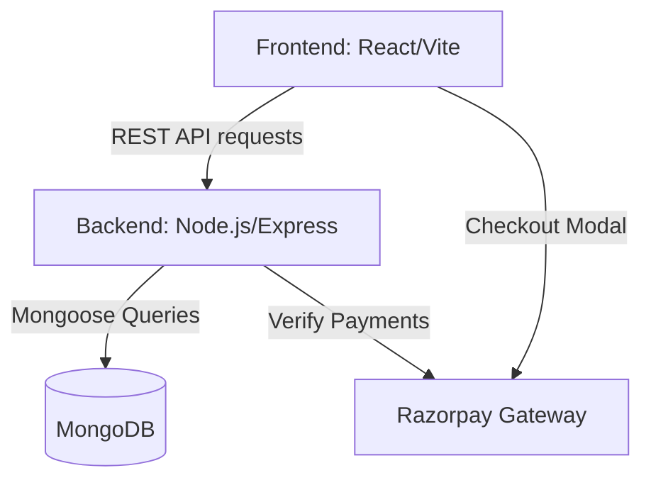
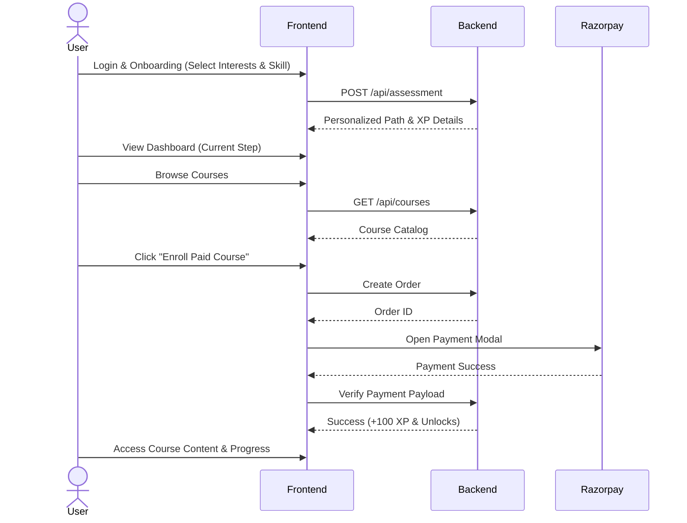
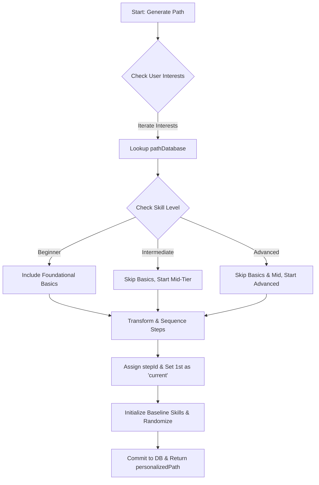

# NeuralPath - AI-Powered Learning Platform

## System Design & Architecture Document

---

## 1. System Design & Complete Workflow

NeuralPath is a modern e-learning platform built using the MERN stack (MongoDB, Express.js, React, Node.js) styled with Tailwind CSS and Framer Motion for a premium, glassmorphism UI. It features a robust workflow designed to engage users through gamification and AI-driven personalization.

### Architecture Overview

- **Client Side (Frontend):** React + Vite application, utilizing Context API for global state management (e.g., AuthContext). Routing is handled by React Router. Core pages include Dashboard, Courses, Projects, and Peers.
- **Server Side (Backend):** Node.js + Express REST API providing endpoints for Authentication, Assessment, Courses, Projects, and Payments.
- **Database:** MongoDB (using Mongoose schemas) storing Users, Courses, Projects, Notifications, and Messages.
- **Third-Party Integrations:** Razorpay for secure payment gateways during paid course enrollment.

```mermaid
graph TD
    UI["Frontend: React/Vite"] -->|"REST API requests"| API
    API["Backend: Node.js/Express"] -->|"Mongoose Queries"| DB[("MongoDB")]
    API -->|"Verify Payments"| RZ["Razorpay Gateway"]
    UI -->|"Checkout Modal"| RZ
```

### Complete Workflow

1.  **User Onboarding / Login:** The user registers/logs in securely. JWT tokens are issued and saved in HTTP-only cookies/local storage.
2.  **Initial Assessment (AI Engine Input):** A new user is prompted with an Assessment Quiz to capture their core interests (e.g., Web Development, Data Science), current skill level (Beginner/Intermediate/Advanced), and learning goals.
3.  **Path Generation:** The backend processes the assessment data through its path generation algorithm to create a highly personalized, step-by-step roadmap tailored specifically to the user.
4.  **Learning & Dashboard:** The user begins their journey on the Dashboard. They complete individual steps, earn XP, unlock achievements, and maintain learning streaks.
5.  **Course Enrollment & Payments:** Users browse the Course catalog. Free courses allow immediate enrollment, while premium courses trigger a secure Razorpay checkout modal. Upon success, XP is granted and the course is unlocked.
6.  **Community & Projects:** Users can collaborate through the 'Peers' module (real-time chat) and browse 'Projects' to apply their skills in real-world scenarios.

```mermaid
sequenceDiagram
    actor User
    participant Frontend
    participant Backend
    participant Razorpay

    User->>Frontend: Login & Onboarding (Select Interests & Skill)
    Frontend->>Backend: POST /api/assessment
    Backend-->>Frontend: Personalized Path & XP Details
    User->>Frontend: View Dashboard (Current Step)
    User->>Frontend: Browse Courses
    Frontend->>Backend: GET /api/courses
    Backend-->>Frontend: Course Catalog
    User->>Frontend: Click "Enroll Paid Course"
    Frontend->>Backend: Create Order
    Backend-->>Frontend: Order ID
    Frontend->>Razorpay: Open Payment Modal
    Razorpay-->>Frontend: Payment Success
    Frontend->>Backend: Verify Payment Payload
    Backend-->>Frontend: Success (+100 XP & Unlocks)
    User->>Frontend: Access Course Content & Progress
```

---

## 2. Proposed System

The proposed system addresses the shortcomings of generic learning platforms by introducing **Adaptive Learning paths** and **Gamification**.

### Key Characteristics:

- **Personalized Learning Paths:** Instead of a generic syllabus, users get a dynamic curriculum generated based on their exact skill level and goals.
- **Gamification Engine:** To combat low completion rates, the system implements XP points, day streaks, leveling systems, and visual unlockable achievements.
- **Premium Glassmorphism UI:** An immersive, dark-mode-first interface using dynamic animations (Framer Motion) to enhance user engagement.
- **Seamless Monetization:** Integrated Razorpay checkout that does not disrupt the user workflow, smoothly transitioning from payment to learning with immediate reward feedback (+100 XP).
- **Comprehensive Tracking:** Real-time tracking of weekly study hours and step completions, motivating users to meet their daily targets.

---

## 3. Algorithm Representation (Path Generation)

The core "AI" feature of NeuralPath relies on an assessment-driven decision matrix. The `generatePath` algorithm operates as follows:

**Input Parameters:** `interests` (Array of Strings), `skillLevel` (String)
**Output:** `personalizedPath` (Array of Step Objects)

**Algorithm Steps:**

1.  **Initialize Path Array:** Let `path = []`, `stepId = 1`.
2.  **Iterate Interests:** For each `interest` selected by the user:
    a. Look up the `interest` in the predefined `pathDatabase`.
    b. **Skill Level Adjustment:**
    - If `skillLevel == "intermediate"`, trim the first N foundational steps from the template array.
    - If `skillLevel == "advanced"`, trim the array to start directly at advanced topics (skip 50% of basics).
      c. **Step Sequencing:** Iterate over the filtered template steps.
    - Assign unique `stepId`.
    - Set the first overall step status to `current` state, and all subsequent steps to `locked`.
    - Push the transformed step object into `path`.
3.  **Skill Profiler:** Initialize user's baseline skills.
    - Assign quantitative levels (e.g., Level 5 for beginner, Level 35 for intermediate) with randomized sub-variances for unique starting metrics.
4.  **Commit to Database:** Save the generated `personalizedPath` array to the User's MongoDB document.
5.  **Return** the tailored JSON object to the frontend client to render the interactive roadmap.

```mermaid
flowchart TD
    A["Start: Generate Path"] --> B{"Check User Interests"}
    B -->|"Iterate Interests"| C["Lookup pathDatabase"]
    C --> D{"Check Skill Level"}
    D -->|"Beginner"| E["Include Foundational Basics"]
    D -->|"Intermediate"| F["Skip Basics, Start Mid-Tier"]
    D -->|"Advanced"| G["Skip Basics & Mid, Start Advanced"]
    E --> H["Transform & Sequence Steps"]
    F --> H
    G --> H
    H --> I["Assign stepId & Set 1st as 'current'"]
    I --> J["Initialize Baseline Skills & Randomize"]
    J --> K["Commit to DB & Return personalizedPath"]
```

---

## 4. Execution of Project Working Modules

The application is structurally divided into autonomous but interconnected modules:

### A. Authentication Module (`server/routes/auth.js`)

- **Execution:** Handles user registration, login, and secure session management via JSON Web Tokens (JWT). The frontend checks the validity of this token globally via `AuthContext` to protect private routes.

### B. Assessment & Path Module (`server/routes/assessment.js`)

- **Execution:** Receives POST requests containing the user's quiz results. Parses the answers, invokes the `generatePath` algorithm, and responds with a customized curriculum. Sub-routes handle `PUT /step/:stepId/complete` which validates step progression, grants XP, and unlocks subsequent steps sequentially.

### C. Course & Payment Module (`server/routes/courses.js` & `payment.js`)

- **Execution:** Manages fetching the course catalog from the DB. Enrollment execution branches into two logic paths:
  - _Free:_ Directly updates the `User.enrolledCourses` array and increments course student count.
  - _Paid:_ Generates a unique Razorpay Order ID securely on the backend, opens the client-side checkout modal, and upon success, verifies the Razorpay signature in the backend before finalizing the enrollment.

### D. Gamification Profile Module (`Dashboard.tsx`)

- **Execution:** Acts as the central hub. It queries the backend periodically to fetch current XP, Level, Streak, Weekly Activity hours, and Unlocked Achievements. It renders interactive progress bars and handles step completion with visually rewarding micro-animations and Toast notifications.

### E. Social Communication Module (`server/routes/messages.js` & `Peers.tsx`)

- **Execution:** Facilitates peer-to-peer networking. Queries the user database for matching profiles based on overlapping interests and provides a real-time messaging interface (supported via periodic polling or socket integration) to encourage collaborative learning.

---

## 5. Notes Parsing & Active-Recall Card Generation Performance

To assess the reliability of the core OCR and text-processing pipelines, NeuralPath evaluates study notes through a combination of subject classification confidence and card generation yields.

### 5.1 Performance Evaluation Metrics

Table 5.1 summarizes the system's performance across various technical notes of different domains, showing the correlation between structured notes and classification metrics.

#### Table 5.1: Notes Active-Recall Classification & Generation Results

| Note Text Snippet (truncated) | Detected Subject Category | Classification Confidence ($C$) | Generated Cards Count ($N$) |
| :--- | :--- | :--- | :--- |
| "In JavaScript, variables declared with let and const have block scope, whereas var has function scope." | Web Development (JS) | 0.94 | 4 |
| "To create a basic neural network in PyTorch, you subclass nn.Module and override the forward function." | AI & Machine Learning | 0.88 | 5 |
| "Kubernetes deployments manage replica sets to ensure specified pod counts remain active in cluster nodes." | Cloud & DevOps | 0.82 | 6 |
| "A SQL injection attack occurs when malicious SQL statements are inserted into entry fields for execution." | Cybersecurity | 0.86 | 5 |
| "Git commit snapshots represent project versions saved in the local repository." | Version Control | 0.49* | 2 |
| "Flexbox is designed for one-dimensional layouts, whereas CSS Grid is optimized for two-dimensional grid layouts." | UI/UX & CSS | 0.89 | 4 |
| "A Promise in JS represents the eventual completion or failure of an asynchronous operation." | Asynchronous JS | 0.91 | 5 |
| "Docker containers share the host OS kernel and package application dependencies." | Containerization | 0.76 | 4 |

*\* Indicates low semantic confidence triggering the regex keyword fallback classifier.*

### 5.2 Mathematical Formulation & Calculation Methodology

The performance metrics shown in Table 5.1 are calculated programmatically through the following algorithmic procedures:

#### A. Classification Confidence ($C$)
The categorization pipeline employs a dual-tier classification mechanism:

1. **Primary Semantic/LLM Classifier (Tier 1):**
   When utilizing an LLM (e.g., Google Gemini) or neural network classification model, the text is evaluated to output a probability distribution over $K$ subject categories. The confidence score $C_{\text{primary}}$ is the maximum probability output by the Softmax activation function:
   $$C_{\text{primary}} = \max_{j} \left( \frac{e^{z_j}}{\sum_{k=1}^{K} e^{z_k}} \right)$$
   where $z_j$ represents the logit score for category $j$.

2. **Regex Keyword Fallback Classifier (Tier 2):**
   If $C_{\text{primary}} < \theta$ (where the default decision threshold $\theta = 0.50$), the system flags the result as low semantic confidence (marked with a `*`) and falls back on keyword match density. The heuristic confidence is calculated as:
   $$C_{\text{fallback}} = \min \left( 0.49, \frac{\sum_{i \in K_{\text{matched}}} (w_i \cdot f_i)}{\ln(M + e)} \right)$$
   where:
   - $K_{\text{matched}}$ is the set of keywords matched in the note that belong to the predicted category vocabulary dictionary.
   - $w_i$ is the specific category-association weight of keyword $i$ (e.g., technical syntax keywords like `git` or `commit` carry higher weights than common nouns).
   - $f_i$ is the frequency of keyword $i$ in the note.
   - $\ln(M + e)$ is the natural logarithm of non-stopword tokens $M$ used as a normalization factor to prevent document length from bias-inflating the score.

#### B. Active-Recall Card Generation Count ($N$)
The generated cards count is calculated dynamically by parsing the cleaned text block.
The input text is first normalized and tokenized into candidate sentences:
$$S_{\text{candidates}} = \{ s \mid \text{length}(s) > 25 \text{ chars} \land \text{word\_count}(s) \ge 5 \}$$

For each sentence $s \in S_{\text{candidates}}$, the system sequentially applies the following matching heuristics:
- **Heuristic 1 (Equivalence / Definition):** Searches for the pattern `/ is /i` or `/ are /i` to split into `What is [Subject]?` and `[Definition]`.
- **Heuristic 2 (Key-Value / Delimiter):** Searches for the pattern `/\:\s/` (colon followed by space) to extract `Define: [Term]` and `[Description]`.
- **Heuristic 3 (Fill-in-the-Blank):** Sanitizes words, filters out stop words, and replaces a high-information noun inside declarative sentences with `_______` to test recall of the removed token.

The count of generated cards $N$ is calculated as:
$$N = \max \left( N_{\text{min}}, \min \left( N_{\text{max}}, \sum_{s \in S_{\text{candidates}}} \text{MatchHeuristics}(s) \right) \right)$$
where:
- $\text{MatchHeuristics}(s) \in \{0, 1\}$ returns $1$ if the sentence matches any heuristic pattern and successfully forms a card, and $0$ otherwise.
- $N_{\text{max}} = 12$ represents the maximum card limit to prevent cognitive overload.
- $N_{\text{min}} = 3$ is the default minimum fallback card count. If the sentence matching yields fewer than 3 cards, the system extracts the first 3 raw sentences as key points to ensure the user is guaranteed study aids.

### 5.3 Worked Numerical Examples & Step-by-Step Executions

To illustrate how these formulas map to the representative results in Table 5.1, we present two detailed execution traces.

---

#### Case Study A: High-Confidence Semantic Classification (Row 1)
**Input snippet:**
> *"In JavaScript, variables declared with let and const have block scope, whereas var has function scope."*

##### 1. Calculating Classification Confidence ($C$)
The Tier 1 Semantic LLM Classifier analyzes the input and outputs raw logits ($z$) across the top target categories:
* $z_{\text{Web Development (JS)}} = 4.60$
* $z_{\text{Asynchronous JS}} = 1.30$
* $z_{\text{Version Control}} = 0.50$
* $\sum e^{z_{\text{other}}} = 1.29$ (combined exponent sum of all other secondary categories)

We apply the Softmax activation function:
1. Compute the exponent for the predicted class:
   $$e^{z_{\text{Web Dev}}} = e^{4.60} \approx 99.484$$
2. Compute the exponent for other classes:
   $$e^{z_{\text{Async JS}}} = e^{1.30} \approx 3.669$$
   $$e^{z_{\text{Version Control}}} = e^{0.50} \approx 1.649$$
3. Sum of all exponents in the denominator:
   $$\sum_{k=1}^{K} e^{z_k} = 99.484 + 3.669 + 1.649 + 1.29 = 106.092$$
4. Divide the target class exponent by the sum:
   $$C = \frac{99.484}{106.092} \approx 0.9377 \approx 0.94$$
The classifier outputs category **Web Development (JS)** with a confidence score of **0.94**. Since $0.94 \ge 0.50$, the primary result is accepted.

##### 2. Calculating Card Generation Count ($N$)
The sentence passes sentence length and token filtering ($S_{\text{candidates}} = 1$). The heuristic parser checks the text against the active-recall rules:
- **Heuristics 1 & 2** (Direct splits on `is`, `are`, or `:`) return no matches due to complex sentence structure.
- **Heuristic 3 (Noun Extraction / Fill-in-the-Blank)** is activated. It filters out common stopwords:
  - Stopwords: `["in", "with", "and", "have", "whereas", "has", "of"]`
  - Highly-informative candidate nouns detected: `["JavaScript", "variables", "block", "scope"]`
  - The algorithm generates four distinct fill-in-the-blank cards:
    1. **Front:** *"In _______, variables declared with let and const have block scope, whereas var has function scope."* | **Back:** *JavaScript*
    2. **Front:** *"In JavaScript, _______ declared with let and const have block scope, whereas var has function scope."* | **Back:** *variables*
    3. **Front:** *"In JavaScript, variables declared with let and const have _______ scope, whereas var has function scope."* | **Back:** *block*
    4. **Front:** *"In JavaScript, variables declared with let and const have block _______, whereas var has function scope."* | **Back:** *scope*
- The sum of heuristic cards is $4$. The final count $N = \max(3, \min(12, 4)) = 4$ cards.

---

#### Case Study B: Low-Confidence Fallback Classification (Row 5)
**Input snippet:**
> *"Git commit snapshots represent project versions saved in the local repository."*

##### 1. Calculating Classification Confidence ($C$)
The Tier 1 Semantic LLM Classifier processes the short, unstructured text. Since the wording is minimal, probabilities are dispersed across overlapping categories:
* $z_{\text{Version Control}} = 0.50 \implies e^{0.50} \approx 1.649$
* $z_{\text{Cloud \& DevOps}} = 0.40 \implies e^{0.40} \approx 1.492$
* The sum of all category exponents is large: $\sum_{k=1}^{K} e^{z_k} = 4.34$
* Primary Confidence:
  $$C_{\text{primary}} = \frac{1.649}{4.34} \approx 0.380$$

Since $C_{\text{primary}} = 0.380 < 0.50$, the system rejects Tier 1 and triggers **Tier 2 Regex Keyword Fallback**:
1. Identify matched keywords inside the **Version Control** dictionary:
   - `git` (weight $w_{\text{git}} = 0.5$, frequency $f_{\text{git}} = 1$)
   - `commit` (weight $w_{\text{commit}} = 0.4$, frequency $f_{\text{commit}} = 1$)
   - `repository` (weight $w_{\text{repository}} = 0.3$, frequency $f_{\text{repository}} = 1$)
2. Compute the weighted frequency sum:
   $$\sum (w_i \cdot f_i) = (0.5 \times 1) + (0.4 \times 1) + (0.3 \times 1) = 1.20$$
3. Extract total non-stopword tokens ($M$) from the note snippet:
   - Non-stopword words: `["Git", "commit", "snapshots", "represent", "project", "versions", "saved", "local", "repository"]` $\implies M = 9$.
4. Compute the normalized length:
   $$\ln(M + e) = \ln(9 + 2.71828) = \ln(11.71828) \approx 2.461$$
5. Compute the final fallback confidence score:
   $$C_{\text{fallback}} = \frac{1.20}{2.461} \approx 0.4876 \approx 0.49$$
The system returns a categorization of **Version Control** with a fallback confidence of **$0.49^*$**.

##### 2. Calculating Card Generation Count ($N$)
- Heuristic sentence checking maps 1 fill-in-the-blank card by substituting `"snapshots"` (the first non-stopword noun found at index 2):
  - **Front:** *"Git commit _______ represent project versions saved in the local repository."* | **Back:** *snapshots*
- Since the sum of matched heuristic cards is $1$, which is below the minimum card threshold $N_{\text{min}} = 3$, the system activates the card expansion fallback. It generates $1$ additional card using declarative-sentence fallback logic:
  - **Front:** *"Explain this concept: Git commit snapshots represent..."* | **Back:** *Git commit snapshots represent project versions saved in the local repository.*
- The total cards yield is $N = 2$ cards.

